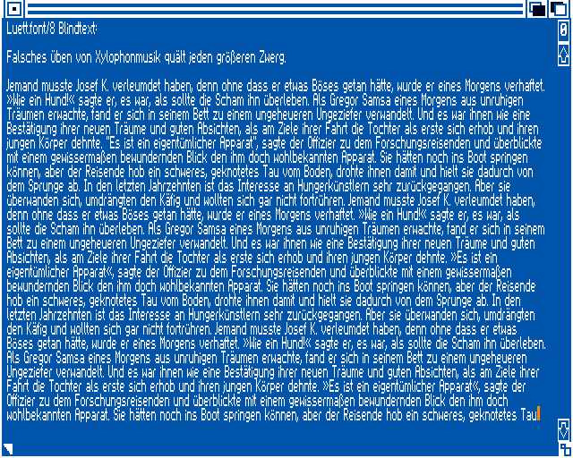
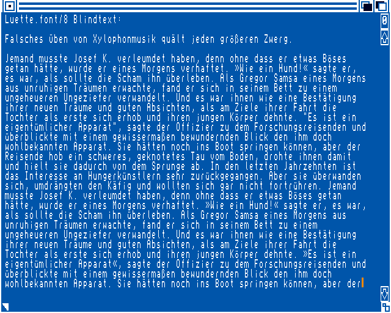
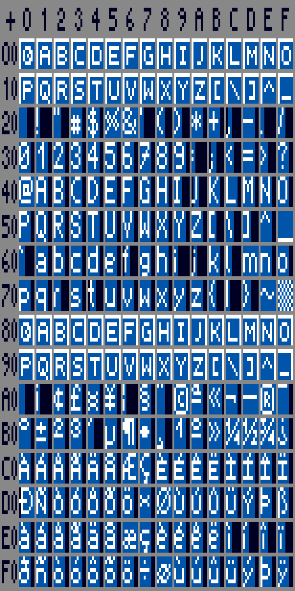
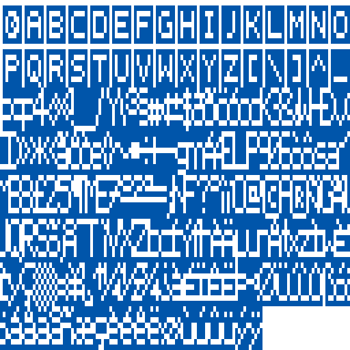

# Amiga font "Luett"

This Amiga bitmap font has been designed for non-interlaced HighRes
and includes separate glyphs for every code point (ISO-8859-1 chars,
all C0/C1 control codes, and even for the null character).

## Install

The font is distributed as `luett-font` on the [Aminet].
So you can just extract the LHA into `FONTS:`.

[Aminet]: https://aminet.net/package/text/bfont/luett-font

## Background

The "Luett" font has been originally designed for a private test ROM in
order to be able to display as much continuous text as possible in HiRes.
Due to the very small font width and thickness, digital video output with
optional integer scaling is highly recommended (e.g. D520, OSSC, RGBtoHDMI).
In this test ROM there are also routines for non-proportional drawing
(for displaying memory dumps) - the glyphs are simply centered by code.
This drawing mode is provided as a separate monospaced font "Luette"
(which otherwise uses the same data as the proportional font "Luett").

Trivia: "Lütt" is Mecklenburg Low German and means small/tiny/thin.

## Screenshots

  

## Charset table

  
Have a look at the [src/luett8.fcom](src/luett8.fcom)
to see the glyphs in ASCII art.

## Design notes

The non-interlaced HiRes resolution has a pixel aspect ratio of 1:2,
therefore a font pixel is expected to be twice as tall as width.

To avoid copyright issues, the glyphs have been designed from scratch.
However, since there is not much space in a 8x8 pixel font, the glyphs
will be very similar or even identical to existing small bitmap fonts.

One of my main usages is displaying memory dumps with hexadecimal numbers
and characters. Most listings use a dot for missing character glyphs
(control code symbols are very unusual in fonts anyway). There are not even
symbols for the C1 control codes in the Unicode standard. The exemplary
graphic pictures for the C0 control codes (Unicode range `2400-241F`) do
not really help for small bitmap fonts, since there is too few space.

So I'm using something like a
Left One Eighth Block (`U+258F`) for C0,
Right One Eighth Block (`U+2595`) for C1,
Upper One Eighth Block (`U+2594`) for all control codes,
and the character from the well-known Caret Notation
(`^L` for `Ctrl+L` results in `U+000C <Form Feed> (FF)`).

|                    image                    | comment                                                                                                             |
| :-----------------------------------------: | :------------------------------------------------------------------------------------------------------------------ |
| ") | Code point `1B`, Unicode `U+001B <Escape> (ESC)`, caret notation `^[`, AmigaOS shell/argument escape sequence `*E`. |
| ") | Code point `9B`, Unicode `U+009B <Control Sequence Introducer> (CSI)`, short form of ANSI escape sequence `<ESC>[`. |

The idea is, that the control code glyphs overlap as much as possible
to save space in the font. Given the font's 992x8 bitmap data (for
display purposes wrapped at 128 font pixels and scaled by 4:8):  
  
the font size is only increased by 768 instead of 1024 bytes
(64 control codes with one long word per character location, and 
two words per kerning/spacing pair - but only 32 8x8 image data).

## License

This work is licensed under multiple licenses.

- All font source code and binary files are licensed under
  [SIL Open Font License 1.1] with Reserved Font Name "Luett"
- Other project configuration, build, and metadata files
  are licensed under [CC0 1.0 Universal].

For more accurate information, check the individual files.

[SIL Open Font License 1.1]: LICENSES/OFL-1.1-RFN.txt
[CC0 1.0 Universal]: LICENSES/CC0-1.0.txt

- TLDRLegal:
  [OFL-1.1](https://www.tldrlegal.com/license/open-font-license-ofl-explained),
  [CC0-1.0](https://www.tldrlegal.com/license/creative-commons-cc0-1-0-universal)
- gnu.org/licenses:
  [OFL-1.1](https://www.gnu.org/licenses/license-list.html#SILOFL),
  [CC0-1.0](https://www.gnu.org/licenses/license-list.html#CC0)

This project attempts to conform to the [REUSE] recommendations,
so you should find license information in/for all project files.

[REUSE]: https://reuse.software/
